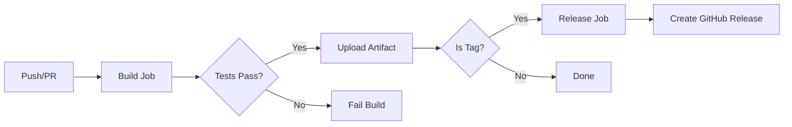

# NoArmor CI/CD Pipeline Documentation

This document explains the GitHub Actions pipeline for the NoArmor plugin.

## Pipeline Overview



## Triggers

| Event | Branches/Tags | Action |
|-------|---------------|--------|
| Push | `main`, `master`, `develop` | Build + Test |
| Push | `v*` tags | Build + Test + Release |
| Pull Request | `main`, `master` | Build + Test |

## Jobs

### 1. Build Job

**Runs on:** Every push and PR

**Steps:**
1. Checkout code
2. Setup Java 21 (Temurin)
3. Build with Maven (`mvn clean package`)
4. Run tests (`mvn test`)
5. Upload JAR artifact

### 2. Release Job

**Runs on:** Only when a version tag (`v*`) is pushed

**Steps:**
1. Build release JAR
2. Create GitHub Release with the JAR attached

## Usage

### Running Tests Locally

```bash
mvn clean test
```

### Building Locally

```bash
mvn clean package
```

### Creating a Release

1. Update version in `pom.xml`
2. Commit changes
3. Create and push a tag:

```bash
git tag v1.0.0
git push origin v1.0.0
```

The pipeline will automatically:
- Build the plugin
- Run all tests
- Create a GitHub Release
- Attach the JAR file

## Artifacts

After each build, the plugin JAR is available as a downloadable artifact:
- Go to Actions tab
- Click on the workflow run
- Download "NoArmor-Plugin" artifact
